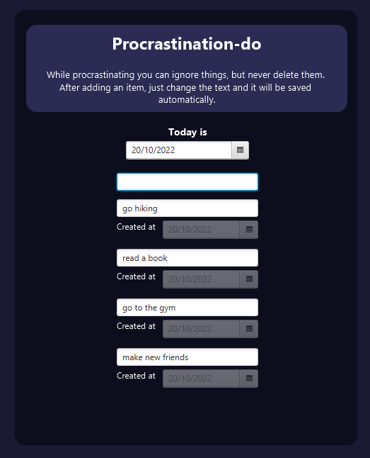
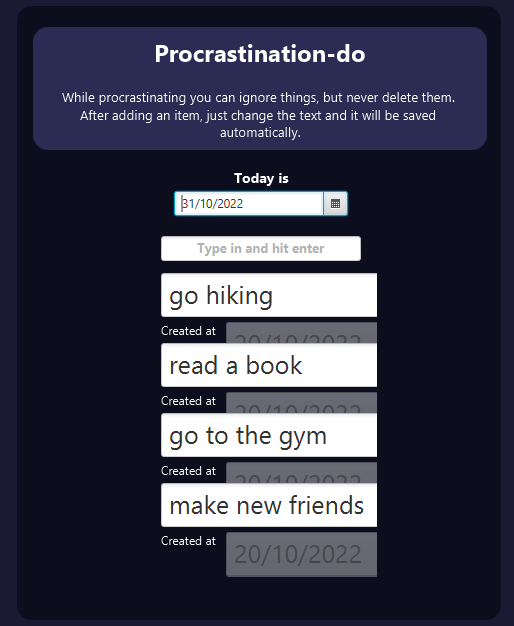
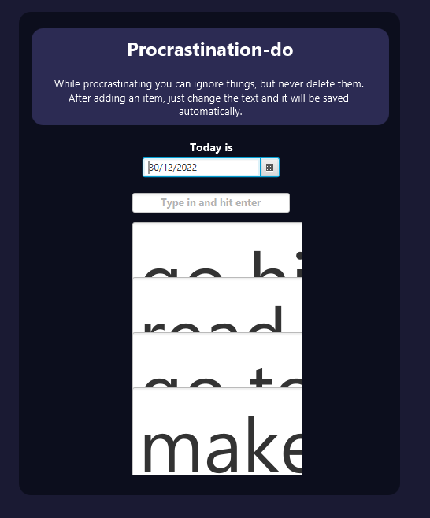

# Procrastination-do

A joke java fx todo app where you add items to procrastinate and as the days goes by their size increases until the app is unusable.

# Running

````
./gradlew run
````

# Application



When you are starting out



Some time has passed



The app is unusable (like your life)

[Checkout the Javascript counterpart here](https://github.com/Artenes/ProcrastinationDoJs).